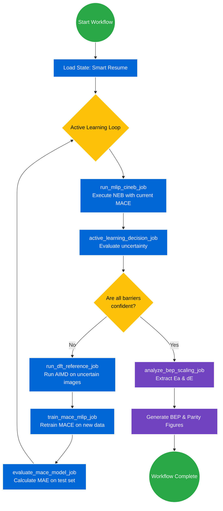
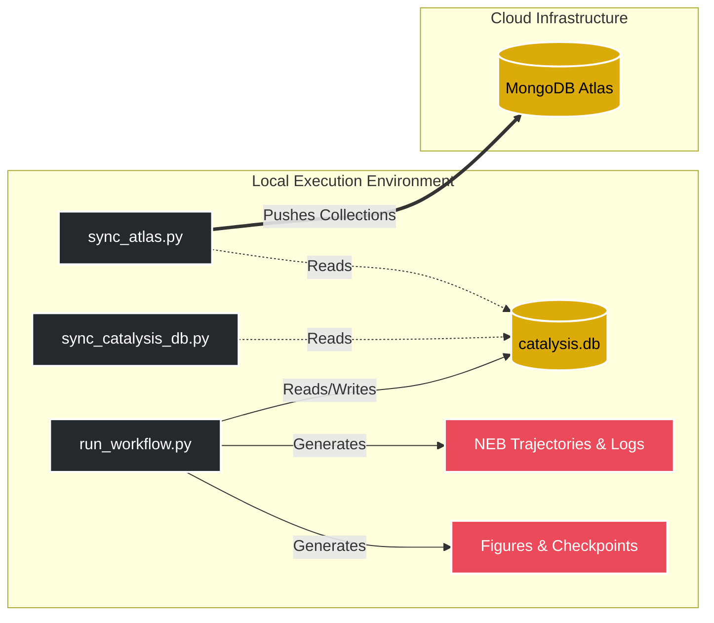
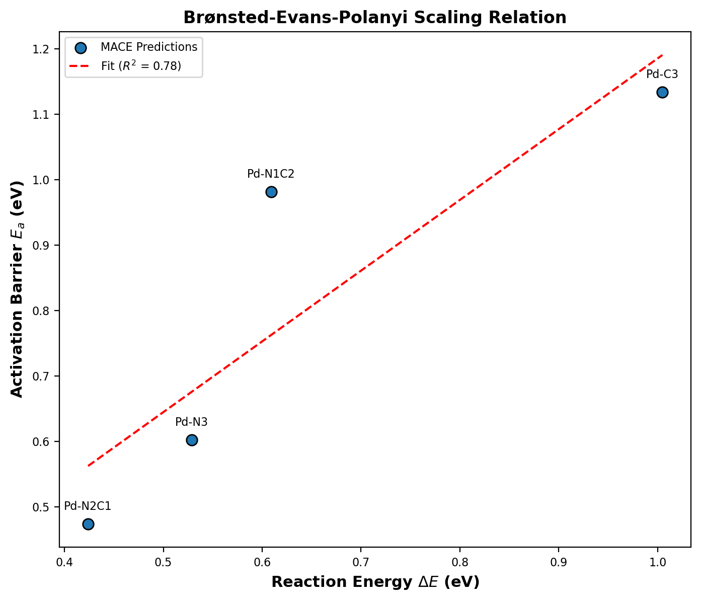
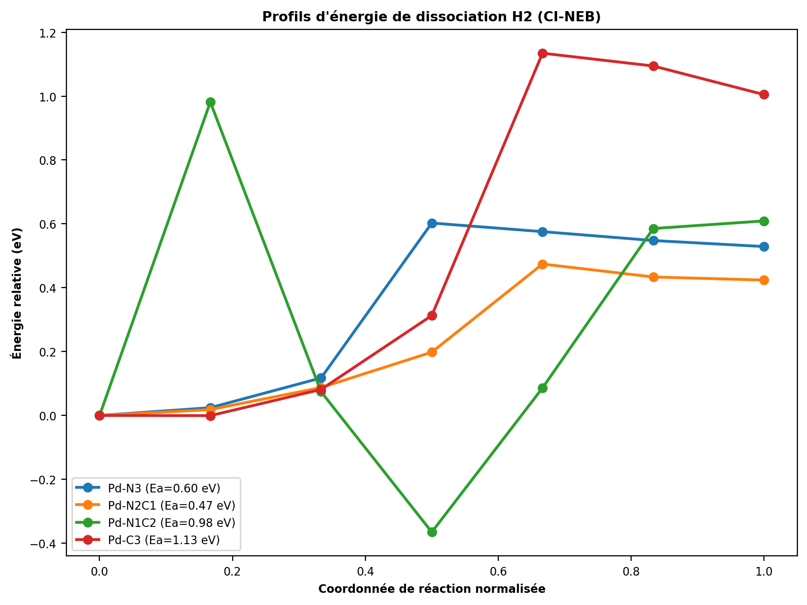
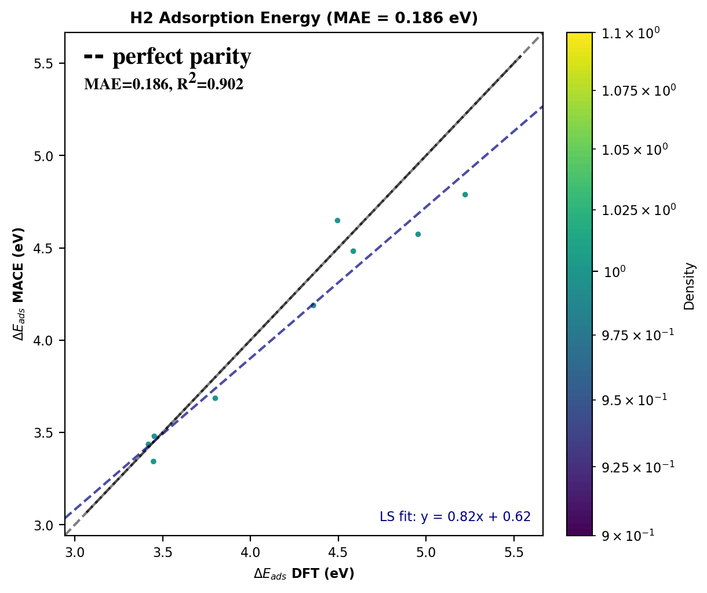
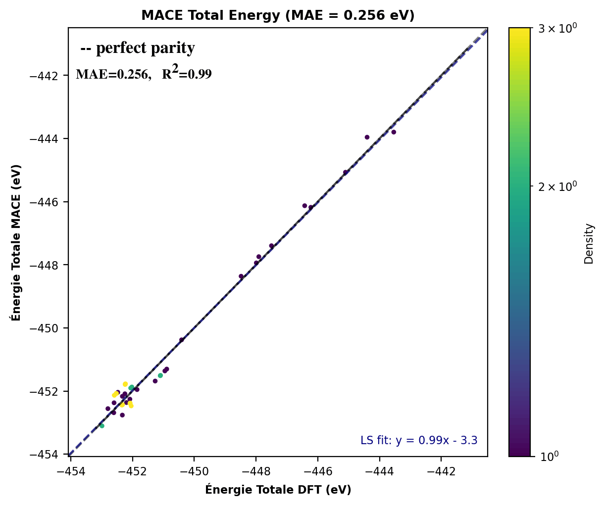
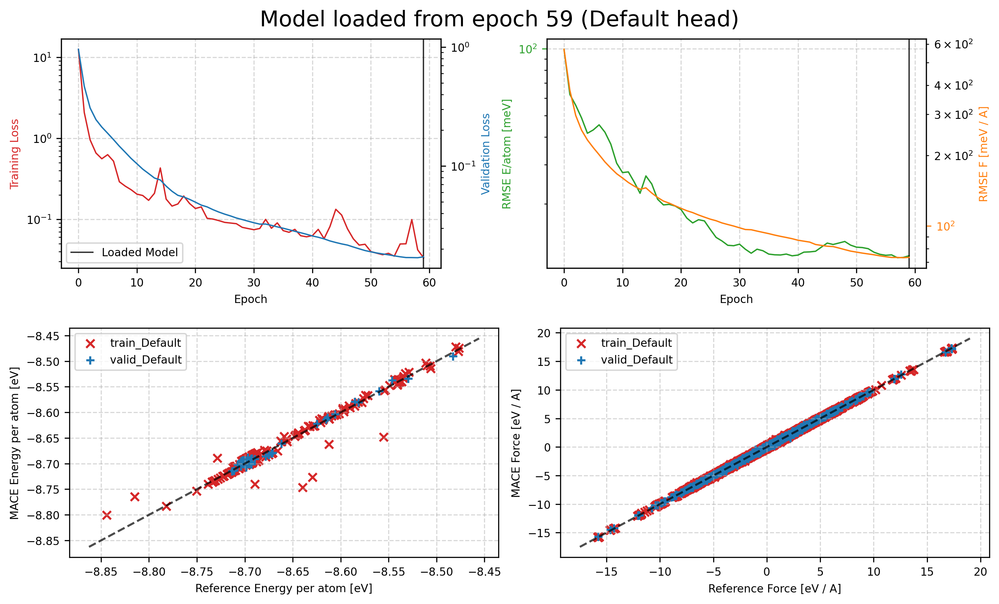

<div align="center">

# ⚛️ MACE-ActiveLearning-SAC

**Autonomous active learning of machine-learned interatomic potentials for single-atom catalysis**

H₂ dissociation on nitrogen-doped graphene-supported palladium (Pd–C<sub>3−x</sub>N<sub>x</sub>)


[](https://doi.org/10.1021/acs.jpclett.5c03805)
[](LICENSE)

[Overview](#-overview) · [Pipeline](#-pipeline-architecture) · [Results](#-key-results) · [Quick start](#-quick-start) · [Structure](#-repository-structure) · [Publication](#-related-publication--citation) · [License](#-license)

</div>

---

## 📖 Overview

This repository hosts an autonomous, data-driven pipeline for evaluating the **kinetic and thermodynamic properties of single-atom catalysts (SACs)**. It investigates hydrogen (H₂) dissociation pathways on nitrogen-doped graphene-supported palladium.

The workflow runs an **active learning loop** that:

- 🧠 trains a Machine Learning Interatomic Potential (**MACE**) on DFT reference data,
- 🚏 automates **CI-NEB** (climbing-image Nudged Elastic Band) calculations,
- 📈 extracts **Brønsted–Evans–Polanyi (BEP)** scaling relations,

all without manual intervention.

> [!NOTE]
> **Scope of this repository.** This is a lightweight, laptop-scale demonstration of the *automated workflow and its mechanism* (active-learning loop, uncertainty-driven decisions, CI-NEB automation, BEP analysis). Calculation settings are deliberately inexpensive, so the numerical values shown below illustrate the method and are not converged production results. All settings are adjustable in [`config.yaml`](config.yaml) for higher-precision runs.

> 📄 **This work is referenced to the following publication:**
> S. Ziat, F. Brix, A. Tsaturyan, B. Kierren, É. Gaudry, *"How N-Doping Promotes Hydrogen Dissociation at Graphene-Based Single-Atom Catalysts"*, **J. Phys. Chem. Lett.**, 2026. [doi:10.1021/acs.jpclett.5c03805](https://doi.org/10.1021/acs.jpclett.5c03805)

---

## 🔧 Pipeline Architecture

The pipeline uses [`jobflow`](https://github.com/materialsproject/jobflow) to orchestrate tasks and make dynamic decisions based on model confidence.

### Active learning loop



### Data synchronization flow



---

## 📊 Key Results

As a demonstration, the automated workflow extracted the kinetic barriers for heterolytic and homolytic H₂ dissociation across several Pd coordination motifs. In this run, nitrogen-rich motifs show lower barriers than the all-carbon Pd–C₃ site.

| Motif | Activation barrier *E<sub>a</sub>* (eV) | Reaction energy *ΔE* (eV) |
| :--- | :---: | :---: |
| **Pd–N₂C₁** | **0.474** | 0.424 |
| Pd–N₃ | 0.603 | 0.529 |
| Pd–N₁C₂ | 0.982 | 0.609 |
| Pd–C₃ | 1.134 | 1.005 |

### BEP scaling relation

The pipeline automatically verified a linear Brønsted–Evans–Polanyi relationship across the dataset:

$$E_a = 1.08\,\Delta E + 0.10 \qquad (R^2 = 0.779)$$

---

## 🖼️ Pipeline Visualizations

Figures are generated into [`figures/`](figures/). Full-resolution vector versions of the parity plots: [adsorption](figures/mace_adsorption_parity-1.png) · [total energy](figures/mace_total_energy_parity-1.png).

### 1. BEP scaling

Linear scaling between thermodynamic reaction energy and kinetic activation barrier across the sampled motifs.

<p align="center">
  
</p>

### 2. Kinetic profiles (CI-NEB)

Reaction pathways for heterolytic and homolytic H₂ dissociation on the active sites, generated by MACE-driven CI-NEB.

<p align="center">
  
</p>

### 3. MACE model accuracy

Parity plots of MACE against DFT reference data.

<table align="center">
  <tr>
    <td align="center"><b>Adsorption energy parity</b><br></td>
    <td align="center"><b>Total energy parity</b><br></td>
  </tr>
</table>

### 4. Training convergence

Loss, energy/force RMSE and parity plots from a MACE training run (checkpoint loaded from epoch 59). Training was kept short on purpose to demonstrate the loop on a laptop; longer training and larger datasets improve accuracy.

<p align="center">
  
</p>

---

## 🚀 Quick Start

### Installation

Requires Python 3.10+ and a configured Conda environment. The pipeline relies on [ASE](https://wiki.fysik.dtu.dk/ase/), [MACE](https://github.com/ACEsuit/mace) and [Jobflow](https://github.com/materialsproject/jobflow).

```bash
git clone https://github.com/safouanziat/MACE-ActiveLearning-SAC.git
cd MACE-ActiveLearning-SAC

# Install core dependencies
pip install ase jobflow mace-torch matplotlib numpy
```

### Usage

**1. Run the active learning pipeline**

Jobflow's *Smart Resume* is enabled: interrupted runs automatically skip previously completed DFT and MACE training steps.

```bash
python run_workflow.py 2>&1 | tee execution_pipeline.log
```

**2. Synchronize databases**

```bash
python sync_catalysis_db.py
python sync_atlas.py
```

> [!CAUTION]
> Do **not** run the synchronization scripts concurrently with `run_workflow.py`. Doing so causes `database is locked` conflicts. Run them only after the pipeline has finished or been safely paused.

### Configuration

Hyperparameters and tolerances (e.g. uncertainty thresholds for the active learning decision) live in [`config.yaml`](config.yaml).

---

## 📁 Repository Structure

```text
.
├── checkpoints/              # Saved model weights during MACE training
├── figures/                  # Generated plots (parity, BEP scaling, energy profiles)
├── gpaw_logs/                # Outputs from DFT reference calculations
├── results/                  # MACE training diagnostics (loss, RMSE, parity)
├── structures_neb/           # Initial and final state .xyz/.traj geometries
├── project2_workflow.py      # Jobflow orchestration and node definitions
├── run_workflow.py           # Main execution entry point for the active learning loop
├── sync_atlas.py             # MongoDB Atlas synchronization script
├── sync_catalysis_db.py      # Local database management script
└── config.yaml               # Pipeline hyperparameters and tolerances
```

---

## 📚 Related Publication & Citation

This repository is associated with the study of H₂ dissociation on N-doped graphene-supported single-atom catalysts reported in:

> **S. Ziat**, F. Brix, A. Tsaturyan, B. Kierren, É. Gaudry,
> *How N-Doping Promotes Hydrogen Dissociation at Graphene-Based Single-Atom Catalysts*,
> **J. Phys. Chem. Lett.**, 2026. [doi:10.1021/acs.jpclett.5c03805](https://doi.org/10.1021/acs.jpclett.5c03805)

If you use this pipeline or its results, please cite the paper:

```bibtex
@article{ziat2026ndoping,
  author  = {Ziat, Safouan and Brix, F. and Tsaturyan, A. and Kierren, B. and Gaudry, {\'E}.},
  title   = {How N-Doping Promotes Hydrogen Dissociation at Graphene-Based Single-Atom Catalysts},
  journal = {The Journal of Physical Chemistry Letters},
  year    = {2026},
  doi     = {10.1021/acs.jpclett.5c03805}
}
```

and, if relevant, the repository itself:

```bibtex
@software{ziat2026mace_activelearning_sac,
  author = {Ziat, Safouan},
  title  = {MACE-ActiveLearning-SAC: Autonomous Active Learning of MLIPs for Single-Atom Catalysis},
  url    = {https://github.com/safouanziat/MACE-ActiveLearning-SAC},
  year   = {2026}
}
```

---

## 📄 License

Released under the [MIT License](LICENSE). Copyright © 2026 Safouan Ziat.

---

## 👤 Author

**Safouan Ziat** · [GitHub](https://github.com/safouanziat)
